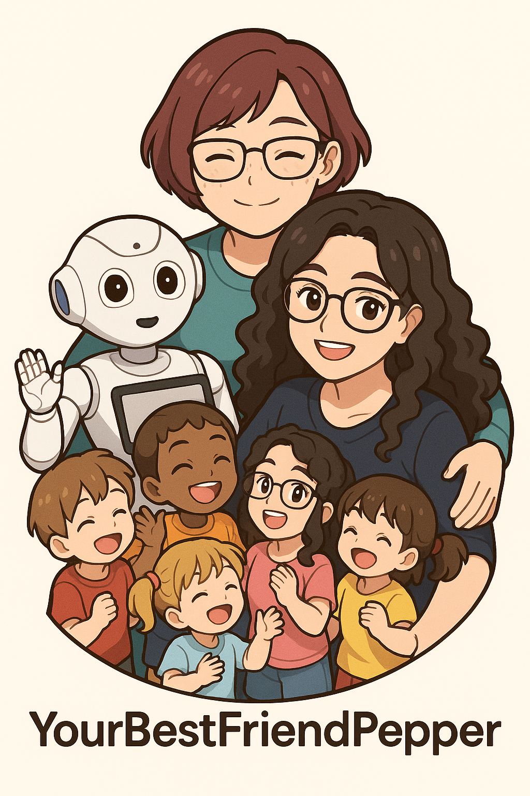

<div align="center">
  
</div>

# YourBestFriendPepper

> **Study and Research Project (TER) – Master 1 Computer Science – HAI823I – 2024‑2025**
> **University of Montpellier**
> Developed by **Hadil Ladj** (MSc Software Engineering) — Supervised by **Prof. Madalina Croitoru**

**YourBestFriendPepper** is an Android application designed for the **Pepper** humanoid robot (SoftBank Robotics). The app offers children aged **3 to 6** an interactive journey to identify, express, and understand emotions through storytelling, tactile interactions, and an AI‑powered open dialogue.

---

## Target Audience

* **Age Range:** 3 – 6 years
* **Settings:** kindergartens, educational workshops, child–robot mediation

---

##  Educational Goals

| Goal                      | Description                                                            |
| ------------------------- | ---------------------------------------------------------------------- |
| **Emotion recognition**   | Link each basic emotion to a colour (*The Colour Monster* story).      |
| **Oral expression**       | Encourage children to verbalise and ask questions to the robot.        |
| **Multimodal engagement** | Combine oral narration **and** tactile feedback to reinforce learning. |

---

## 🔍 Research Question

> **“How does a speech-touch bimodal interaction with the Pepper humanoid robot affect emotion-recognition and verbalization in preschoolers (3–6 years)?”**

This question guides the experimental study described in the TER report. The present README focuses on the software implementation.

---

## User Flow

1. **Welcome Screen:** illustration + **Start** button.
2. **Main Menu:** four features — Listen to a story • Emotion interaction • Talk with Pepper (ChatGPT) • Comprehension quiz.
3. **Stories:**

   * Pepper’s self‑introduction;
   * *The Colour Monster* by Anna Llenas;
   * *Mammoth Helmouth’s Furry Wig* by Val Reiyel.
4. **Emotion Interaction:** child picks an emotion (joy, sadness, anger, fear) → Pepper plays an animation and waits for touch sensors. A **Bye‑bye** button ends the session.
5. **Free Dialogue:** Pepper, powered by the ChatGPT API, answers children’s questions in his own persona.
6. **Quiz:** multiple‑choice questions to validate understanding of the story and emotions.


---

## 🛠️ Technology Stack

| Technology                                    | Purpose                                                                             |
| --------------------------------------------- | ----------------------------------------------------------------------------------- |
| **Android Studio Bumblebee 2021.1.1 Patch 1** | Development & deployment on Pepper                                                  |
| **QiSDK**                                     | Access to Pepper’s voice, motion, and tactile sensors (robot running **NAOqi 2.9**) |
| **Kotlin**                                    | Main language (fragment‑based architecture)                                         |
| **Room / SQLite**                             | Local persistence (quiz answers, logs)                                              |
| **OpenAI API**                                | AI‑generated responses (ChatGPT)                                                    |

---

## ⚡ Setup & Requirements

1. **OpenAI API Key:** add your key in `src/main/java/com/example/pepperapp/ui/Fragments/ChatFragment.kt` at line 54.
2. **Start Pepper:** press the button under the screen **once** to boot.
3. **Network:** connect Pepper and your laptop to the same Wi‑Fi or mobile hotspot.
4. **ADB Connection:** pull down Pepper’s notification bar to get the IP address, then:

   ```bash
   adb connect <PEPPER_IP>:5555
   ```
6. **Android Studio:**

   * Open the project with **Android Studio Bumblebee**.
   * Verify Pepper appears as a connected device.
   * If not:

     ```bash
     adb kill-server
     adb start-server
     adb connect <PEPPER_IP>:5555
     ```

---

## ▶️ Run the App

1. Configure the **OpenAI API key**.
2. Boot Pepper.
3. Establish **ADB connection**.
4. In Android Studio, select Pepper and press ▶️ to install and launch the app.

---

## Code Structure

```
app/
 ├─ ui/
 │   ├─ MainActivity.kt       
 │   └─ Fragments/
 │       ├─ HappyFragment.kt  # joy
 │       ├─ SadFragment.kt    # sadness
 │       └─ …
 ├─ data/                     # Room database (quiz, logs)
 └─ assets/animations/        # .qianim animation files
```

---

> *“Pepper isn’t just a robot — he’s children’s best friend!”* 🤖💛
